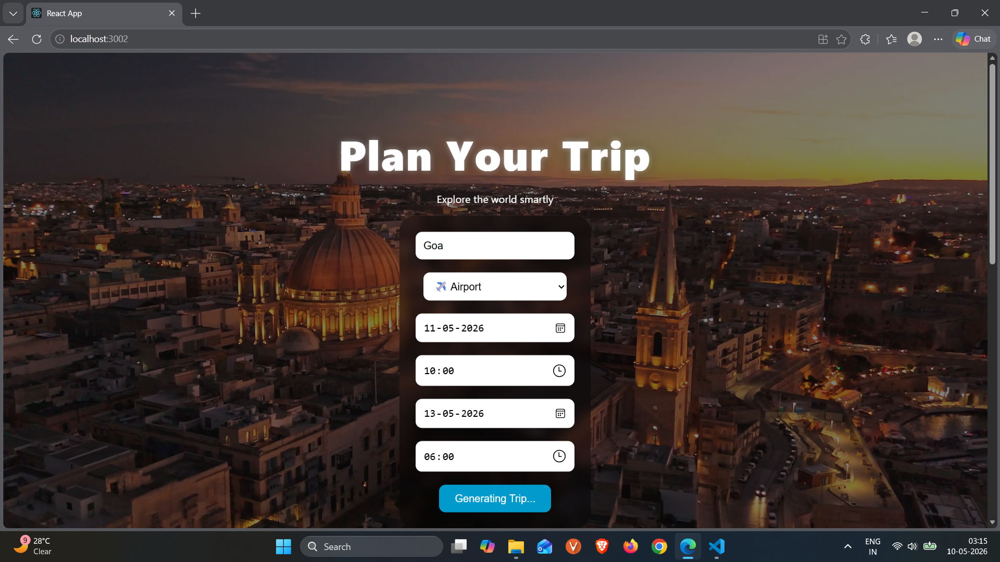
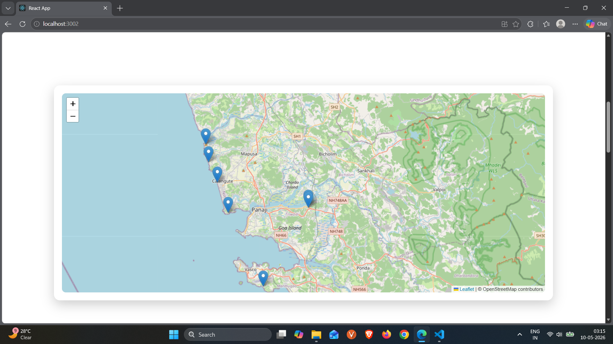
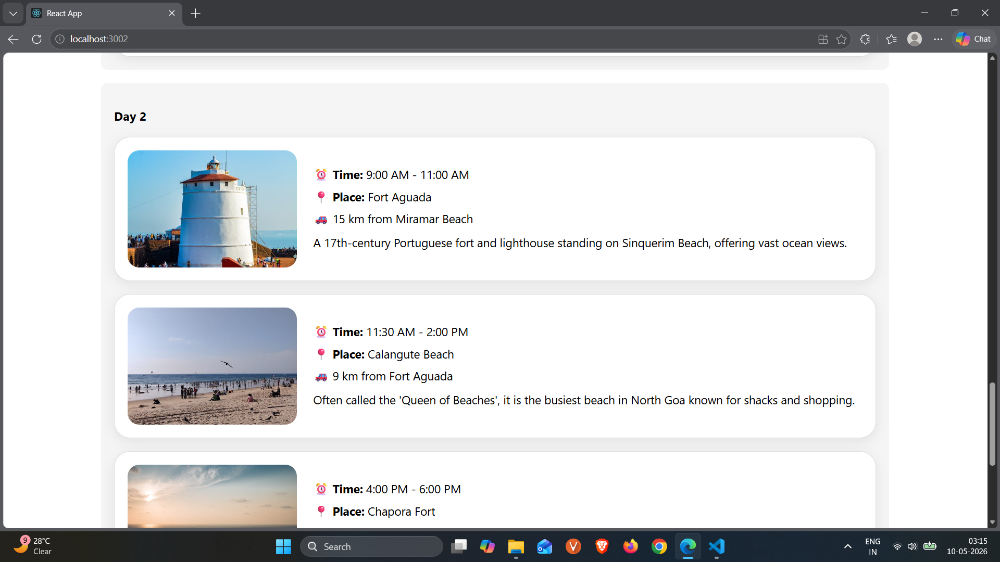
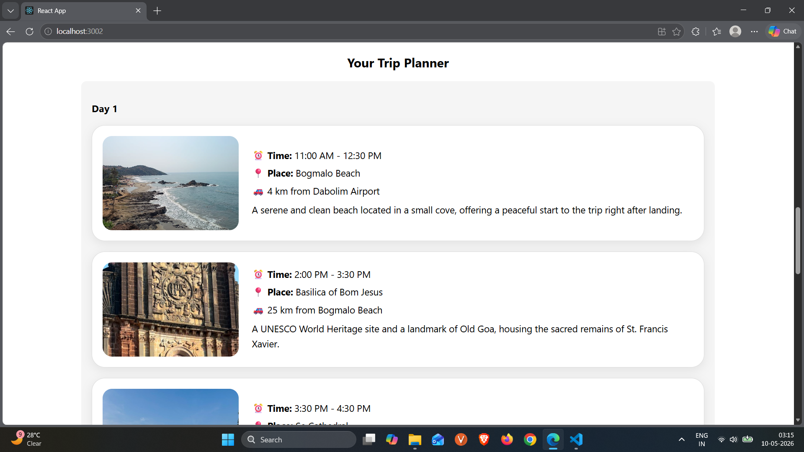

# AI Trip Planner 

An AI-powered travel planning web application that generates smart day-wise trip itineraries with maps and tourist place images.

----------------------------------------------------------------------------------------------------------------------------------------------

## Features

- AI-generated travel itinerary
- Day-wise trip planning
- Interactive map integration
- Tourist place images using Pexels API
- Responsive and modern UI
- Location markers on map
- Travel timing and distance suggestions

----------------------------------------------------------------------------------------------------------------------------------------------

## Technologies Used

- React.js
- JavaScript
- CSS
- Google Gemini AI API
- Leaflet Maps
- Pexels API

----------------------------------------------------------------------------------------------------------------------------------------------

## Screenshots

### Homepage

### Map View

### Trip Result 1

### Trip Result 2

----------------------------------------------------------------------------------------------------------------------------------------------

## Installation

1. Clone the repository
[ git clone https://github.com/thecodingwolf3107/ai-trip-planner.git]

2. Navigate to project folder
 [ cd ai-trip-planner/client ]

3. Install dependencies
   [ npm install ]

4. Create .env file
  [ REACT_APP_GEMINI_API_KEY=your_api_key ,
  REACT_APP_PEXELS_API_KEY=your_api_key ]

5. Start the development server
   [ npm start ]

----------------------------------------------------------------------------------------------------------------------------------------------

## Future Improvements
-> Hotel recommendations
-> Weather integration
-> Budget estimation
-> Authentication system
-> Save trip feature

----------------------------------------------------------------------------------------------------------------------------------------------

Author

Ayushman Kumar

   
